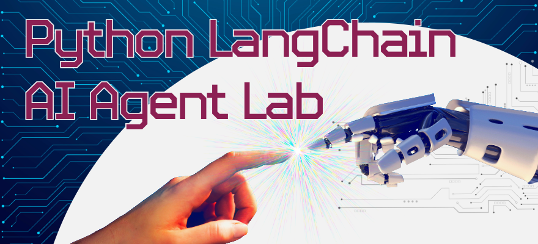

<p align="center">
  
</p>

# AI Agent Lab

This repository contains a **student lab project** exploring how to build a simple, tool‑calling AI agent using **LangChain** and **GitHub Models**, implemented in **both Python and JavaScript**.

The purpose of this project is not just to “get an agent working,” but to understand:
- how agents differ from basic chat completions
- how tool invocation and orchestration work
- how language choice affects implementation details
- how to integrate LLM APIs **safely**, without accidental rate‑limit abuse

This work was completed as part of the [Code:You](https://code-you.org/) AI curriculum.

---

## Project Overview

The repository is intentionally **polyglot**.  
The same conceptual agent is implemented twice:

- once in **Python**
- once in **JavaScript (Node.js)**

Each implementation is self‑contained, with its own dependencies, runtime assumptions, and safety controls. This structure mirrors how real-world teams compare stacks, prototype in parallel, or port systems across languages.

---

## Repository Structure
```
ai_agent_lab/
├── python_langchain/        # Python implementation
├── javascript_langchain/    # JavaScript (Node.js) implementation
├── assets/                  # Images
├── .gitignore
├── example.env              # sample .env
└── README.md                # You are here
```
---

## Python Implementation

**Location:** `python_langchain/`

The Python version focuses on:
- LangChain’s Python APIs
- explicit flag‑based control over API calls
- safe local testing without external requests
- clear separation between tool logic and agent execution

Key characteristics:
- Uses a Python virtual environment
- Dependencies managed via `requirements.txt`
- Optional rate‑limit probe utility
- Emphasizes defensive defaults to prevent accidental API overuse

See `python_langchain/README.md` for full details.

---

## JavaScript Implementation

**Location:** `javascript_langchain/`

The JavaScript version explores:
- LangChain’s JavaScript APIs
- Node.js execution patterns
- async/await‑based agent orchestration
- equivalent safety controls adapted for a JS runtime

Key characteristics:
- Uses Node.js 18+
- Dependencies managed via `package.json`
- `node_modules` provides dependency isolation
- Explicit runtime flags to gate API usage

See `javascript_langchain/README.md` for full details.

---

## Environment Variables

Both implementations rely on a GitHub Models token supplied via environment variables.

There is file, example.env, which demonstrates how your github token should be stored

Notes:
- Tokens are **never committed**
- The same token may be reused across both implementations
- External API calls are guarded by runtime flags in both languages

---

## Rate‑Limit & Cost Safety

A core design goal of this lab is **avoiding accidental API abuse**.

Across both implementations, the project emphasizes:
- explicit enable/disable flags for agent execution
- DRY‑RUN style safeguards
- cooldowns between requests
- failing fast when limits are hit
- encouraging local logic testing before any API calls

The default posture is:  
**safe, quiet, and boring — until you explicitly opt in.**

---

## Educational Intent

This lab is designed to:
- reinforce agent fundamentals
- highlight differences between Python and JavaScript ecosystems
- model responsible LLM usage
- build intuition for orchestration, not just prompting

It is **not** production‑ready software.

---

## License

Educational use only.
