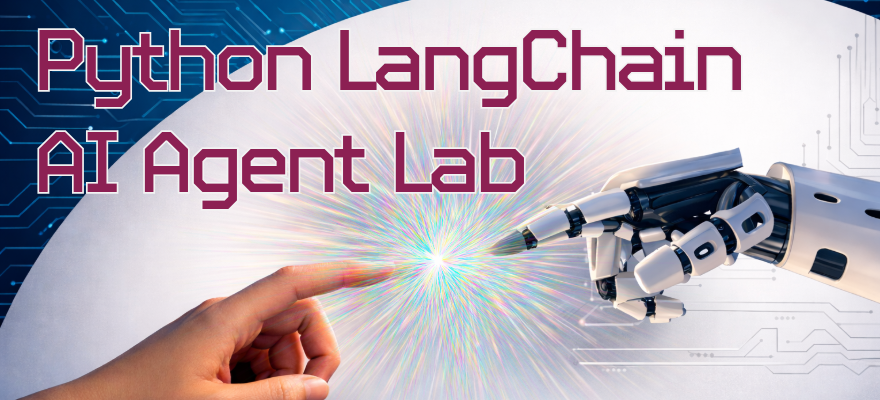

<p align="center">
  
</p>

# Python LangChain AI Agent (Lab)

This project is a **student lab demo** that explores how to build a simple tool-calling AI agent using **LangChain** and **GitHub Models**. It was completed as part of [Code:You](https://code-you.org/) AI course curriculum.

The goal of this lab is to understand:
- how agents differ from simple chat completions
- how tools are defined and invoked
- how to safely integrate an external LLM API
- how to avoid accidental rate-limit abuse during development

---

## Features

- Loads a GitHub Models API token from `.env`
- Creates a `ChatOpenAI` client pointing at GitHub Models
- Defines several simple tools:
  - Calculator (AST-based, restricted evaluation)
  - Current time
  - Current date
  - String reversal
  - Mock weather lookup
- Demonstrates tool-calling through a LangChain agent
- Includes explicit safety flags to control when API calls occur
- **Includes a rate limit probe utility to check your current API rate limit status**

---

## Project Structure

```
python-langchain/
├── app.py
├── rate_limit_probe.py   # Utility to check API rate limit status
├── .env                  # API token (not committed)
├── .gitignore
└── README.md
```

---

## Requirements

- Python 3.10+
- Virtual environment recommended
- Access to GitHub Models

Install dependencies (example):

```bash
pip install langchain langchain-openai python-dotenv
```

---

## Environment Setup

Create a `.env` file in the project root:

```env
GITHUB_TOKEN=your_github_models_token_here
```

This token is **only required when running agent tests or the rate limit probe**.  
Local tool tests do **not** require any API access.

---

## Testing Flags (Important)

All external model calls are explicitly controlled by flags at the top of `app.py`.

```python
DRY_RUN = False
RUN_LOCAL_TOOL_TESTS = True
RUN_AGENT_TESTS = False
COOLDOWN_SECONDS = 8
DEBUG = False
```

### RUN_LOCAL_TOOL_TESTS

- Runs local tool tests only
- No API calls are made
- Safe to run even when rate-limited
- Does not require a GitHub token

---

### RUN_AGENT_TESTS

- Enables LLM and agent execution
- Initializes the model
- Sends queries to GitHub Models
- Uses LangChain tool-calling

When set to `False`, **no API calls occur**.

---

### DRY_RUN

- Additional safety switch
- If `True`, agent tests are skipped even if enabled
- Guarantees no external API calls

---

### COOLDOWN_SECONDS

- Adds a delay between agent queries
- Helps avoid triggering rate limits
- Only applies when agent tests are enabled

---

### DEBUG

- Enables verbose/debug logging (if supported by LangChain)
- Can increase token usage
- Disabled by default

---

## Recommended Flag Combinations

### Local Testing Only (No API Calls)

```python
RUN_LOCAL_TOOL_TESTS = True
RUN_AGENT_TESTS = False
```

---

### Agent Testing (Uses API)

```python
RUN_LOCAL_TOOL_TESTS = False
RUN_AGENT_TESTS = True
COOLDOWN_SECONDS = 8
```

---

## Running the Program

From the project directory:

```bash
python app.py
```

---

## Rate Limit Probe Utility

A dedicated script, `rate_limit_probe.py`, is included to help you check your current API rate limit status **before running agent tests**. This helps you avoid accidental rate limit violations.

### Usage

```bash
python rate_limit_probe.py
```

- Loads your GitHub Models token from `.env`
- Sends a minimal request to the API
- Prints whether you are currently rate-limited and how long to wait if so

---

## Rate Limiting Behavior

- HTTP 429 errors are detected
- Retries are intentionally limited
- The program fails fast with clear messaging
- Cooldowns reduce accidental API spamming
- Use `rate_limit_probe.py` to check your status before running agent tests

---

## Security Notes

- API tokens are loaded from environment variables
- `.env` files should never be committed
- The calculator tool is **not production-safe**
  - Implemented strictly for educational purposes

---

## Educational Context

This lab demonstrates:
- basic AI agent orchestration
- tool-based reasoning
- controlled API usage
- safe local testing patterns

---

## License

Educational use only.
